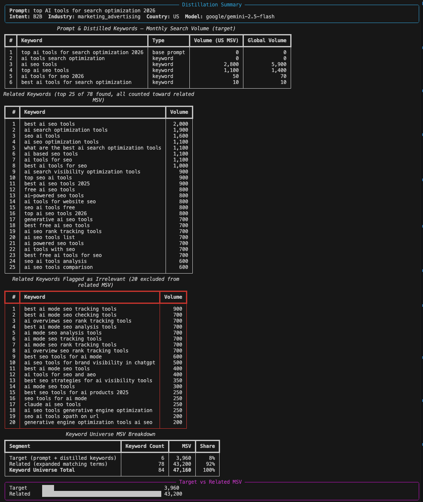

# Prompt-Keyword Distillation

Takes a natural-language prompt, classifies it as B2B or B2C with an industry, distills it into
3-6 search keywords using an LLM, then looks up real monthly search volume (MSV) for those
keywords via the Ahrefs API and expands them into a related-keyword universe.

## Setup

Requires Python 3.10+.

1. Create and activate a virtual environment:

   ```bash
   python3 -m venv .venv
   source .venv/bin/activate
   ```

2. Install dependencies:

   ```bash
   pip install -r requirements.txt
   ```

3. Create a `.env` file in the project root with your API keys:

   ```
   AHREFS_API_KEY=your_ahrefs_key
   OPENROUTER_API_KEY=your_openrouter_key
   ```

## Running the distillation pipeline

```bash
python main.py "What is the best CRM software for a small business"
```

Optional flags:

| Flag | Default | Description |
|---|---|---|
| `--country` | `us` | ISO 3166-1 alpha-2 country code for MSV lookup |
| `--model` | `google/gemini-2.5-flash` | OpenRouter model id used for distillation |
| `--related-limit` | `100` | Max related/matching terms fetched from Ahrefs |
| `--related-display-limit` | `25` | Max related terms printed in the table |
| `--csv` | off | Export all target and related keyword data to `outputs/{prompt}_distillation_yyyymmdd.csv` |
| `--filter-related` / `--no-filter-related` | on | Run a batched LLM relevance check on related keywords and exclude off-topic ones from the related MSV total |

Example with options:

```bash
python main.py "Best project management tools for remote teams" --country gb --model anthropic/claude-sonnet-4.6
```

The output includes:

- A summary panel (intent, industry, country, model)
- A table of the base prompt and distilled keywords with MSV
- A table of related/expanded keywords with MSV
- A target vs. related MSV breakdown with percentage share
- A simple bar chart comparing target and related MSV

### Example output

```bash
python main.py "top AI tools for search optimization 2026" --filter-related
```



Pass `--csv` to also write every target and related keyword row (with volume, global volume,
intent, industry, country, and model) to `outputs/{prompt}_distillation_yyyymmdd.csv`. The
`outputs/` directory is created automatically and is gitignored.

Ahrefs' related-keyword expansion (`matching-terms`) is purely lexical, so it can surface
phrases that share a word or two with your keywords but are actually about a different brand
or entity (e.g. "amazon pricing strategy" for a seed of "pricing strategy") or are garbled
compound phrases. By default, one extra batched LLM call classifies each related keyword as
relevant/irrelevant to your prompt; irrelevant ones are excluded from the related MSV total and
shown separately in their own "Flagged as Irrelevant" table (and, if `--csv` is passed, written
with `keyword_type=related_flagged_irrelevant` rather than dropped). Pass `--no-filter-related`
to skip this and keep the raw, unfiltered related keyword list. If the filtering call itself
fails, the pipeline fails open and keeps all related keywords rather than dropping data.

## Evaluating candidate LLMs

`evaluate_models.py` runs every model in `CANDIDATE_MODELS` (see
[distiller/llm_client.py](distiller/llm_client.py)) against held-out prompts from
`reference-files/reference_distillation.json` and ranks them by Ahrefs MSV hit rate:

```bash
python evaluate_models.py
```

Optional flags:

| Flag | Default | Description |
|---|---|---|
| `--per-industry` | `2` | Number of held-out reference prompts to test per industry |
| `--country` | `us` | Ahrefs country code |
| `--verbose` | off | Also print per-prompt results |

## Running tests

```bash
pytest
```

Tests mock all HTTP calls (OpenRouter and Ahrefs) with `respx`, so no API keys or network access
are required to run the suite.
